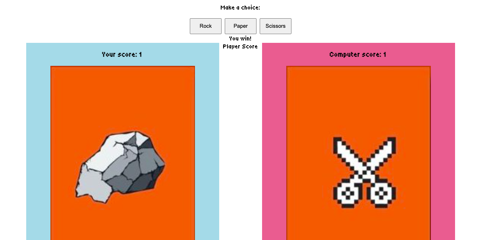
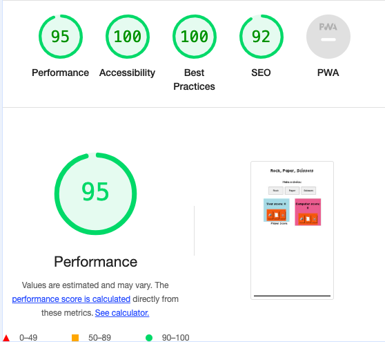

# Rock, Paper, Scissors Game

This is a simple Rock, Paper, Scissors game implemented using HTML, CSS, and JavaScript. The game allows a player to compete against the computer by selecting rock, paper, or scissors. The game displays the choices, updates the scores, and announces the winner of each round.

[Include a link to a live demo or a screenshot of the game]

## Features

- Interactive UI for selecting rock, paper, or scissors
- Random computer choice for each round
- Score tracking for both player and computer
- Display of the current choice images for both player and computer
- Announcement of the winner of each round

## Technologies

- HTML5
- CSS3
- JavaScript

## How to Play
Open the game in your web browser.
Click on the "Rock", "Paper", or "Scissors" button to make your choice.
The computer will make a random choice.
The game will display the choices, update the scores, and announce the winner of the round.

## Features left to Implement
 - If I had more time, I would like to add a feature where if you reach a certain score, the images change.

 ## Testing
 - I tested this game in different browsers: Chrome, Firefox, Safari.
 - I confirmed the header, instructions, and footer text are all readable and easy to understand.
 - I confirmed that the colours and fonts chosen are easy to read and accessible by running lighthouse in devtools
 

 ## Bug
 - Solved bug: 
 - Addressed an issue where scores were not updating correctly. The bug was due to using local variables for scores  
   without updating the DOM elements directly. This was fixed by ensuring the scores were incremented and updated directly in the DOM elements (`playerScore.textContent` and `computerScore.textContent`) using `parseInt` to correctly handle string to number conversion.

## Validator Testing
- HTML
* No errors were returned when passing through official W3C validator
- CSS
* No errors were found when passing through the official (Jigsaw) validator

## Deployment
- The site was deployed to GitHub pages. The steps to deploy are as follows:
* In the GitHub pages. The steps to deploy are as follows:
* From the source section drop-down menu, select the Master Branch
* Once the master branch has been selected, the page provided the link to the completed website

The live link can be found here - 

## Credits
- Content Images obtained from
* [Link Text](https://thereader.mitpress.mit.edu/the-psychological-depths-of-rock-paper-scissors/)
- Code institute, rock paper scissors walkthrough
- Javascript code [Link Text](https://hackr.io/blog/how-to-build-rock-paper-scissors-in-javascript)
- ChatGPT to troubleshoot, debug and fix Javascript code
